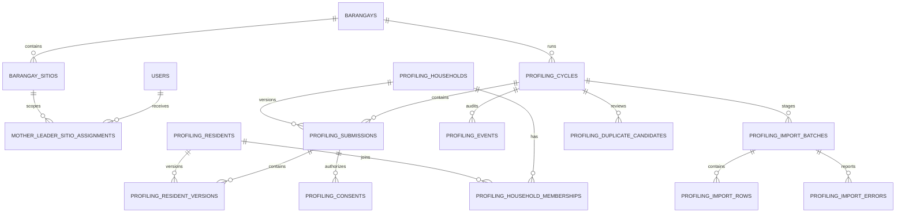

# Phase 1 Profiling Data Dictionary

## Identity and geography

| Entity | Purpose | Key controls |
|---|---|---|
| `barangay_sitios` | Authoritative sitio/purok names and aliases | Barangay-scoped; inactive rather than deleted |
| `mother_leader_sitio_assignments` | Effective-dated collection authority | Operational assignments; audited changes |
| `profiling_code_counters` | Concurrency-safe readable IDs | Database-owned; immutable issued codes |
| `profiling_households` | Stable household UUID and code | `active/moved/dissolved/merged`; versioned |
| `profiling_residents` | Stable consented resident UUID and code | `active/inactive/deceased/merged`; versioned |
| `profiling_household_memberships` | Effective household relationship | Effective dates and immutable history |

Readable codes use the configured barangay prefix: `<PREFIX>-HH-000001` and `<PREFIX>-RES-000001`. UUIDs remain authoritative.

## Governance and cycles

| Entity | Purpose | Lifecycle |
|---|---|---|
| `profiling_privacy_notices` | Approved notice text/version/controller details | Published versions retained |
| `profiling_privacy_settings` | Suppression and export policy | Threshold at least 5; identifiable export disabled |
| `profiling_runtime_settings` | Database-enforced admission mode and synthetic allowlists | `off/synthetic/live`; live requires recorded privacy approval |
| `profiling_cycles` | Sample plan, dates, target, and provenance | `draft → collecting → validating → completed → archived` |
| `official_population_snapshots` | Official totals separate from sample | Source and as-of date required |
| `profiling_sample_units` | Selection/contact/refusal outcomes | Minimal refusal/non-participation data only |

Cycle completion is a Researcher action after all packages and duplicate candidates are resolved. Captain endorsement is independent and does not change approved counts.

## Versioned profiles and consent

| Entity | Purpose | Key controls |
|---|---|---|
| `profiling_submissions` | Atomic household package/revision | `draft → pending → approved/returned → superseded`; optimistic version |
| `profiling_resident_versions` | Immutable profile snapshot per package | Prohibited-field checks; never overwritten |
| `profiling_consents` | Household/adult/guardian authorization | Notice version and signer relationship retained |
| `profiling_events` | Immutable decisions and lifecycle history | Append-only actor, reason, from/to state |
| `profiling_lifecycle_events` | Effective-dated moves, transfers, deaths, merges, and withdrawals | Expected-version action; immutable reason and target |

Household data includes sitio, optional landmark/contact, bracketed income, housing/utilities/sanitation/devices/hazards, and controlled needs. Resident data includes names, birth date or estimated age, controlled demographic/education/employment categories, bracketed income, skills, broad support categories, time-limited pregnancy fields, 4Ps/solo-parent indicators, and controlled planning needs.

Government IDs, photographs, biometrics, exact GPS, exact income, diagnoses/clinical documents, passwords, and unnecessary medical free text are prohibited. An identifiable resident row is not created without granted adult consent or guardian authorization for a minor. Minor status is derived at the cycle collection date from birth date or estimated age; `is_minor` is not an accepted input field.

## Imports and duplicates

| Entity | Purpose | Retention |
|---|---|---|
| `profiling_import_batches` | Hash/template/count/status metadata | Retained for audit |
| `profiling_import_rows` | Sanitized package staging | Payload purged after commit or 30 days |
| `profiling_import_errors` | Row/field validation errors | Purged with staging after commit/expiry; aggregate error counts remain |
| `profiling_duplicate_candidates` | Human decision queue | `linked/distinct/exclude`; never auto-merged; immutable decision event remains after staging purge |

Import lifecycle is `uploaded → validating → needs_correction/ready → committed/failed/purged`. Corrections are new hash-addressed uploads linked through `replaces_batch_id`. Commit is idempotent and atomic, creates pending packages, and immediately removes staged payloads, row keys, errors, and duplicate references.

## Analytics

`ProfilingAggregateDTO` contains schema version, cycle, sample target/count/coverage, approved resident count, source, as-of date, privacy settings, data-quality counts, and suppressed categorical cells. It contains no names, codes, contacts, dates of birth, addresses, raw profiles, or drill-through identifiers. `household_profiles` remains a read-only legacy source and never contributes to this DTO.

Completed cycles create an immutable `profiling_evidence_snapshots` record using schema `agape.profiling.aggregate.v2` and a canonical content hash. New proposal profiling evidence links point to this aggregate snapshot; historical household links remain readable only in redacted form.

