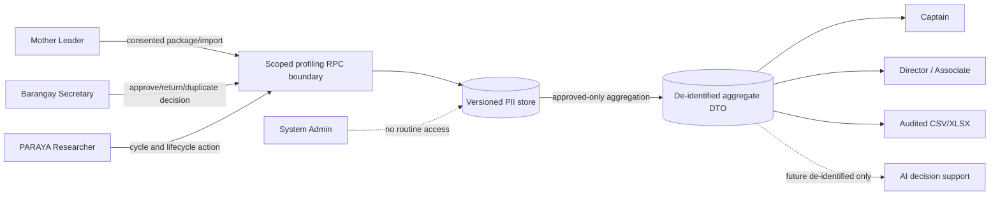

# Phase 1 Research-Document Updates

## Actors and use cases

The canonical actor/use-case diagram is
[`docs/diagrams/phase-1-actors-and-use-cases.mmd`](../diagrams/phase-1-actors-and-use-cases.mmd).

- Replace institutional Office/Organization/Department login actors with non-login Partner/Proponent records. Temporary legacy accounts are read-only migration aids, not a target-state actor.
- System Admin manages accounts, audit, and infrastructure only. Remove resident browsing and operational approvals from Admin use cases.
- Add Mother Leader collect/import, Secretary validate/return/deduplicate, Captain approved-view/endorse, Researcher cycle/lifecycle, and Director/Associate aggregate-only use cases.
- Show the Researcher-owned opaque sample register before Mother Leader collection. Reprofiling reuses stable Household and Resident IDs; lifecycle changes close and open effective-dated membership rows rather than replacing identities.
- Finance remains proposal-budget clearance only and has no profiling authority.

## DFD boundary

The canonical Phase 1 DFD is
[`docs/diagrams/phase-1-dfd.mmd`](../diagrams/phase-1-dfd.mmd), and the normalized
profiling ERD is [`docs/diagrams/phase-1-erd.mmd`](../diagrams/phase-1-erd.mmd).

## Methodology language

Describe profiling as a sampled-household study, not a barangay census. All usual residents of selected households may be represented only with the required household and adult/guardian consent. State sample method, target, contacted/refused/excluded packages, approved sample size, response/coverage, dates, source, and limitations. Official barangay totals must be separately labeled with source and as-of date.

Biñang 2nd is the primary pilot. Real collection requires the approved notice, controller/DPO contact, retention/correction/refusal procedure, official sitio list, assignments, sampling plan, and privacy approval. Use synthetic data before that gate.

## Privacy and analytics

Document data minimization, prohibited fields, immutable audit/version history, lifecycle correction, and the absence of identifiable exports. Minor status is derived from birth date or estimated age at the collection date and cannot be asserted by a collector. Statistical tables suppress counts from one through four at the initial threshold of five and use complementary suppression; when no peer can protect a single small category, suppress the whole dimension. Suppressed cells have no drill-through.

## Test evidence to include

- role/capability and cross-barangay/cross-sitio denial matrix;
- adult/minor consent and prohibited-field cases;
- manual and XLSX/CSV workflows with Secretary approval/return;
- duplicate human decision and idempotent atomic commit;
- move/death/transfer/correction version history;
- official-versus-sample reconciliation and small-cell suppression;
- proof that raw resident fields never reach analytics or AI;
- migration replay, rollback rehearsal, accessibility, responsive layout, and synthetic-pilot results.

## Deferred claims

Do not claim AI profiling recommendations, beneficiary estimation, unaddressed-needs automation, OCR, blockchain, or full demographic reporting as Phase 1 results. Blockchain remains provisional until Sir Paul identifies the exact research problem and finalized non-PII records requiring tamper-evident proof.
